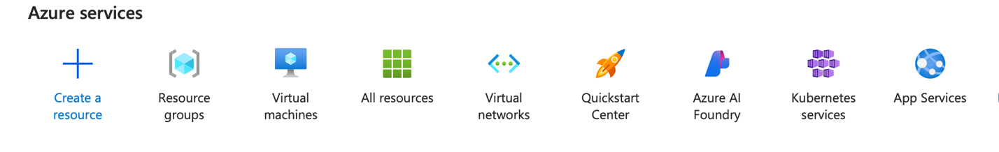
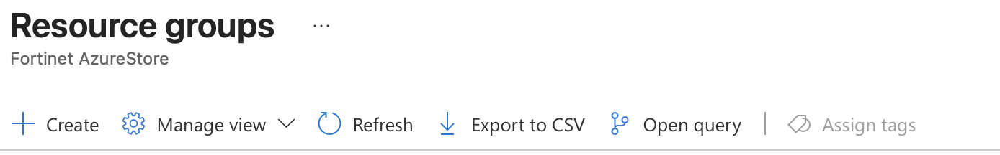
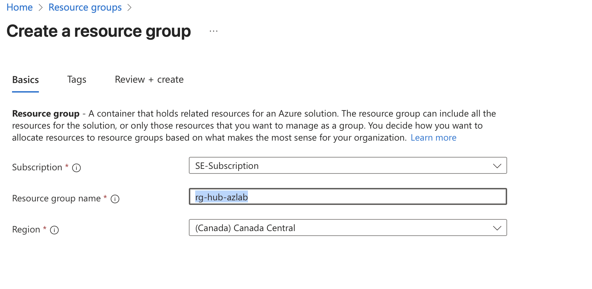
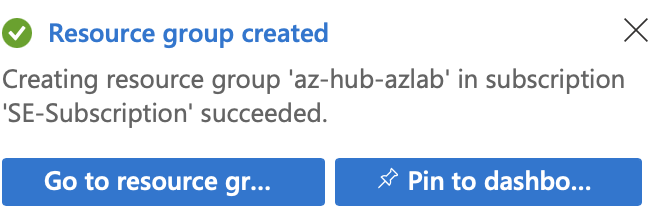

# Resource Group Setup

A resource group is the foundational container for organizing all your Azure resources. Think of it as a logical folder that helps you manage and find your virtual machines, networks, security appliances, and other components more easily.

## Steps to Create Resource Group

1.  In the Azure subscription you have decided to use, Click on Resource Group under Azure services.

    > 

2.  Click Create.

    > 

3.  Choose your appropriate subscription.

4.  Enter `rg-hub-azlab` in the Resource Group name.

5.  Under region select Canada Central.

    !!! info "Did you know?"
        A region in Azure is defined as a collection of Azure data centers connected by a high-capacity, low-latency network, all within a specific geography, to provide local access to cloud services.

    > 

    !!! note
        Your subscription may look different than the one in this lab guide.

6.  Click Review + create at the bottom of the screen.

    > 

7.  At the bottom of the screen click the blue Create button.

8.  A window will pop up in the right hand corner, saying Resource group created. Click on the Go to resource group button.

    > 

9.  Now that we have created a resource group, we can start adding resources to it. The first thing we are going to create is the virtual network.

---

**Next Step:** [Network Setup](01-network-infrastructure.md) to create the virtual network foundation.