# Testing & Validation

In this section, we'll deploy spoke networks and test virtual machines to validate your connectivity hub architecture and ensure all components work together properly.

## On this page
- [Architecture Overview](#architecture-overview)
- [Spoke Network Deployment](#spoke-network-deployment)
- [Test Virtual Machines](#test-virtual-machines)
- [Connectivity Testing](#connectivity-testing)
- [Traffic Flow Validation](#traffic-flow-validation)
- [Security Testing](#security-testing)
- [Performance Validation](#performance-validation)
- [Monitoring Setup](#monitoring-setup)

## Architecture Overview

There are two common methods for deploying applications:

-   :material-hub-outline: **Hub and Spoke Topology**

    ---

    Using Hub and Spoke topology with vnet peering for scalable architectures.

    **Best for:**
    
    - Production and development environment separation
    - Shared services deployment (security, NTP, DNS, Active Directory)
    - Controlling communications between workloads
    - Separate vnets for each workload

-   :material-shield-outline: **Protected Subnet**

    ---

    Using the Protected subnet within the Connectivity Hub vnet for simplified deployments.

    **Best for:**
    
    - Simpler network architectures
    - Applications requiring direct hub connectivity
    - Single-tenant scenarios

## Spoke Network Deployment

We are now going to create our spokes to deploy our "applications" into. We are going to utilize our existing resource group to do so. However, in a production environment you can choose to create separate resource groups for spokes if that fits your business model better.

The purpose of this lab is to simulate basic connectivity, so we are not going to deploy a real functioning application. Let's pretend we have an app that requires a public facing front end, and a back end that only the "webserver" front end will talk to.

1.  Navigate to your rg-hub-azlab resource group. You can search for it by name in the search bar at top of the screen if needed.

2.  Click on Create.

    > 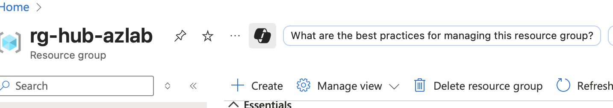

3.  In the 'Search the Marketplace' textbox, type virtual network and press enter on the keyboard.

    > 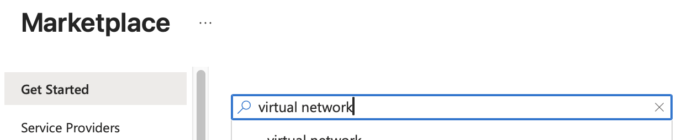

4.  Click on Create under the virtual network option.

    > 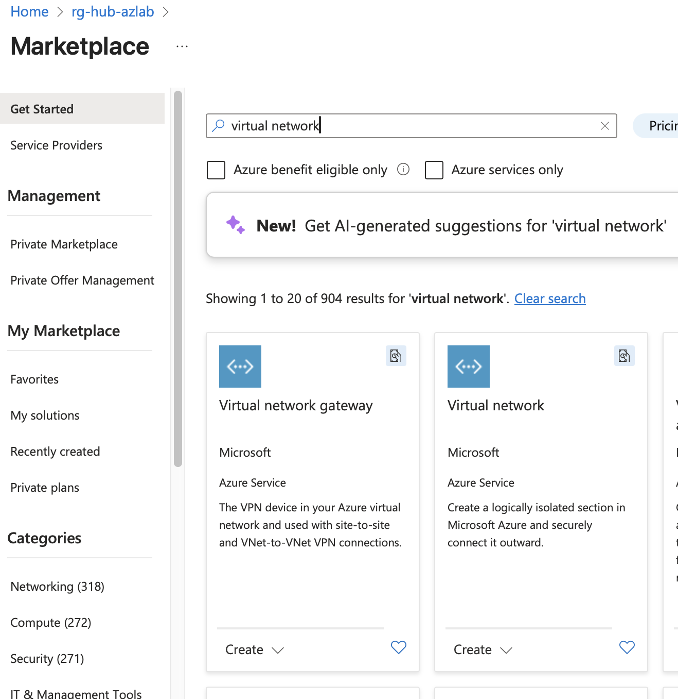

5.  Click on Virtual Network from the dropdown.

6.  Ensure the resource group is rg-hub-azlab.

7.  Set the name as vnet-frontend-spoke.

8.  Ensure the Region is set to Canada Central.

    > 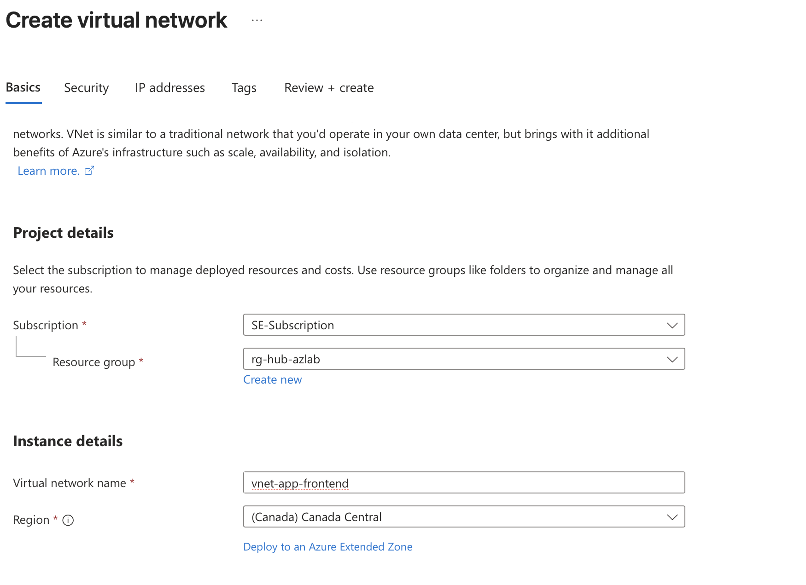

9.  At the bottom of the screen click Next Security.

10. We are not going to create a bastion this time so click Next: IP addresses.

    > 

11. Change the subnet to 192.168.1.0 and select /24 from the dropdown menu.

12. Click Review and create at the bottom of the screen.

    > 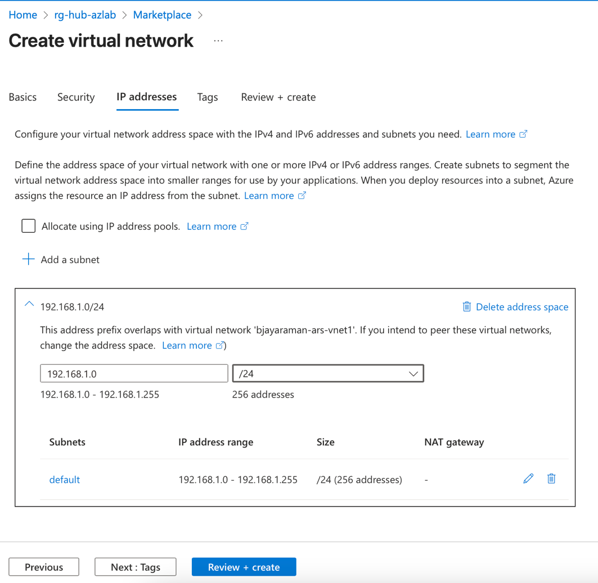

26. Allow the validation to process.

27. Click create at the bottom of the screen.

    > 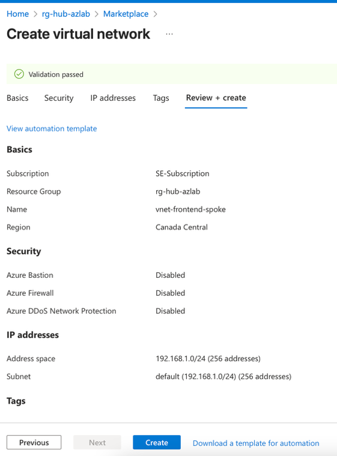

28. Your screen should look like the screenshot below when completed.

    > 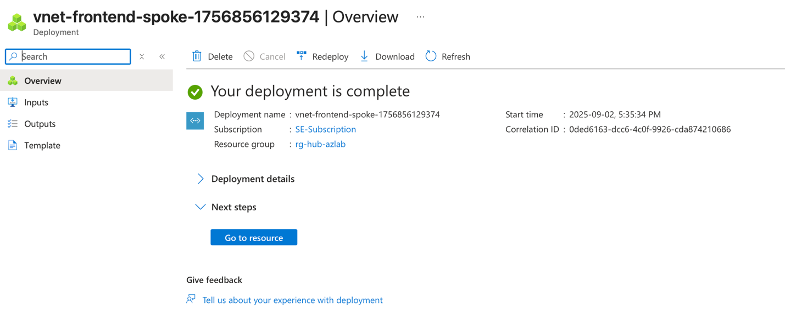

## Test Virtual Machines

**Create a Virtual Machine**

29. We are now going to create the virtual machine to represent our 'app' in this spoke.

30. Search for rg-hub-azlab in the search box at the top of the screen.

31. Once you open the resource group click Create.

    > 

32. In the 'Search the Marketplace' textbox, type virtual machine and press enter

33. Under the virtual Machine click the Create button.

34. Select Virtual machine from the dropdown.

    > 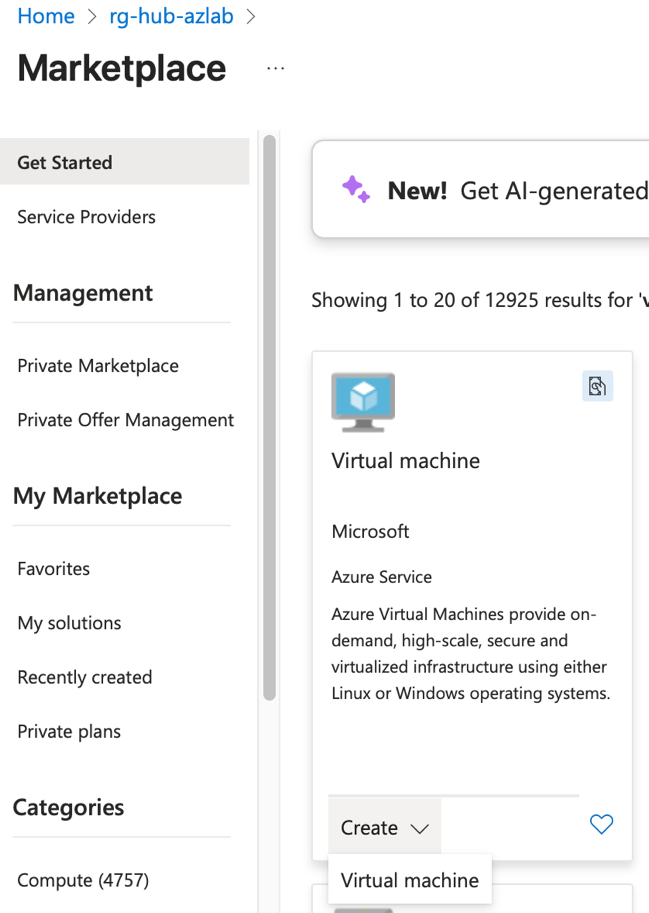

35. Ensure your resource group is set to rg-hub-azlab.

36. Set the Virtual machine name to vm-frontend-app1

37. Set Region to Canada Central

38. Under availability options select No infrastructure redundancy required.

    a.  We are doing this in the lab for simplicity reasons. You may choose differently for a real production application.

39. Select security type to Standard.

    > 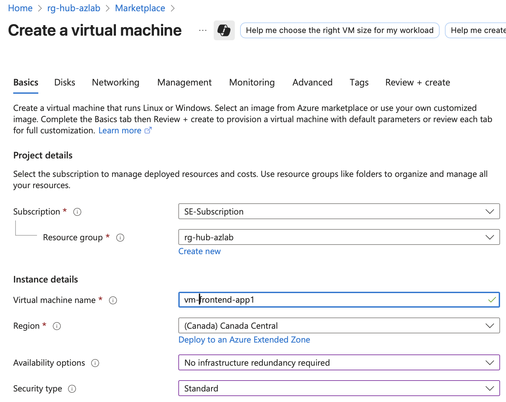

40. Click on the arrow beside the image text box and search for Ubuntu Server 24.04 and select 'Ubuntu Server 24.04 LTS -- x64 Gen2'.

41. Scroll down until you see the Size option and click the drop down.

42. Select Standard_D2s_v3 -- 2 vcpus, 8GiB memory.

    > 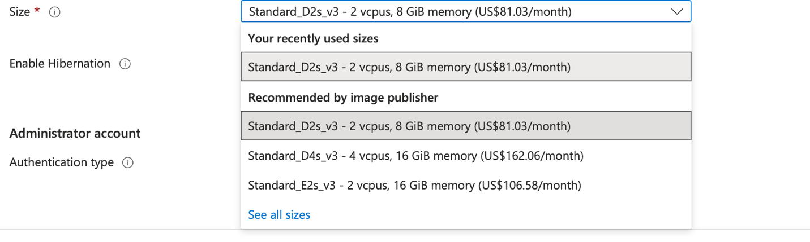

43. Scroll down to the Administrator account section.

44. Change the Authentication type to Password.

45. Set the username as `azureuser`

46. Set the password as `HappyChicken123!`

47. Type the same password in Confirm password `HappyChicken123!`

    > 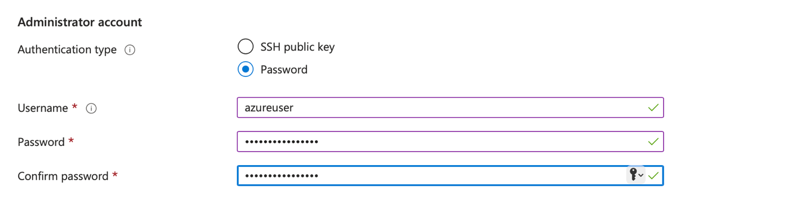

48. !!! warning "Important"
        Set Public inbound ports to None

    > 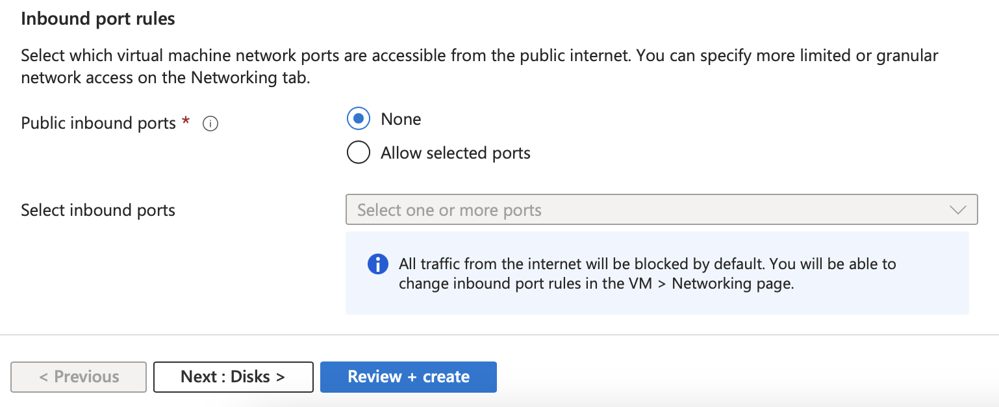

49. Click Next: Disks\> as shown in the screenshot above.

50. Leave everything at its default on the Disks screen and click Next : Networking.

    > 

51. Click the dropdown for Virtual Network and scroll until you find vnet-frontend-spoke and select it.

52. Ensure the subnet is default (192.168.1.0/24).

53. Set the Public IP to none.

54. Click

    > 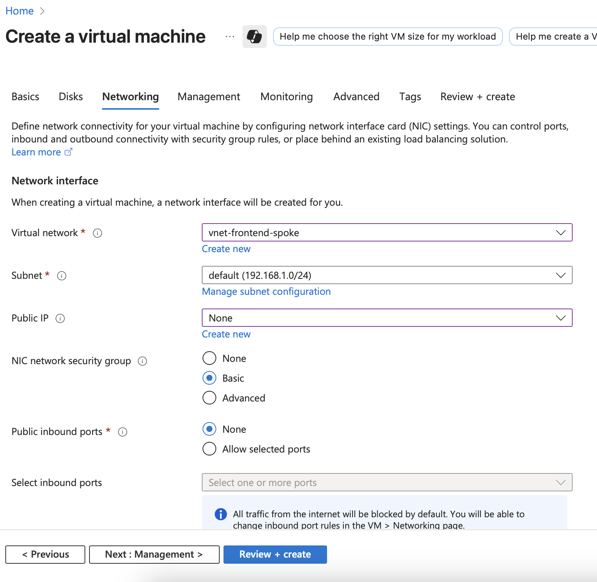

55. Click Create at the bottom of the screen once the validation passes.

56. Wait for your virtual machine to be deployed, this will take a couple minutes.

## Connectivity Testing

!!! info "Testing Phase"
    At this point, you have successfully deployed the core architecture components. The next steps involve validating that all components can communicate properly and that security policies are working as expected.

**Test scenarios to validate:**

1. **Azure Bastion Connectivity**
   - Verify you can connect to VMs through Azure Bastion
   - Test RDP/SSH access without public IP addresses

2. **Inter-subnet Communication**
   - Test communication between different subnets
   - Verify FortiGate is properly routing traffic

3. **High Availability Testing**
   - Test FortiGate failover scenarios
   - Verify load balancer functionality

## Traffic Flow Validation

**Expected Traffic Flows:**

- Hub-to-Spoke communication through FortiGate
- Spoke-to-Internet traffic via FortiGate external interface
- Management traffic through dedicated management subnet
- HA synchronization through HA_Intra-Cluster subnet

## Security Testing

**Security Validation Points:**

- Verify no direct internet access from spoke networks
- Test FortiGate firewall rules
- Validate network segmentation between subnets
- Confirm Azure Bastion provides secure access

## Performance Validation

**Performance Benchmarks:**

- Network latency between components
- FortiGate throughput testing
- Load balancer response times
- Overall architecture performance metrics

## Monitoring Setup

**Recommended Monitoring:**

- Azure Monitor for resource health
- FortiGate logging and monitoring
- Network performance metrics
- Security event monitoring

---

**Next Step:** [Configuration & Ops](04-advanced-operations.md) for ongoing management and troubleshooting.